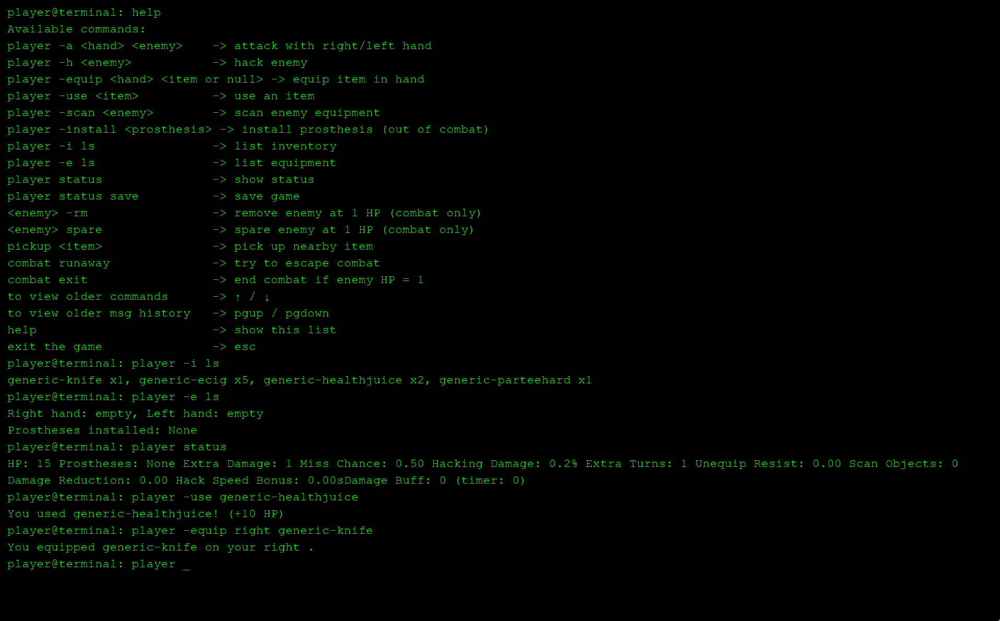

# Protocol Onboarding

**Projeto:** Protocol Onboarding RPG (UFF 2025.2)
**Autores:** Mariana Pacheco, Tiago Daumas Vanni  
**Descrição:** Um RPG de terminal cyberpunk. Via comandos de terminal, o jogador personaliza armas e próteses, e enfrenta inimigos.

---

## Índice

1. [Visão Geral](#visão-geral)  
2. [Funcionalidades](#funcionalidades)  
3. [Instalação](#instalação)  
4. [Como Jogar](#como-jogar)
5. [Exemplos de Gameplay](#exemplos-de-gameplay)
6. [Créditos](#créditos)  

---

## Visão Geral

Protocol Onboarding é um jogo de aventura e combate ambientado em um mundo cyberpunk, onde o jogador controla seu personagem através de um terminal. Cada ação é realizada por comandos de texto, permitindo ataques, hacks, instalação de próteses, coleta de itens e gerenciamento de inventário.

---


---

## Funcionalidades

- Sistema de combate por terminal (ataque, hack, fugir).  
- Equipe de próteses e armas personalizáveis com grades especiais.  
- Inventário e itens consumíveis.  
- Inimigos dinâmicos e IA com comportamento de combate.  
- Sistema de saves e slots de jogo.  
- Autocompletar comandos no terminal.  
- Créditos e encerramento com limpeza de dados.  

---

## Instalação

1. Clone o repositório:  
```bash
git clone <URL_DO_REPOSITORIO>
```
2. Instale dependências:
```bash
pip install -r requirements.txt
```
3. Execute o jogo:
```bash
python main.py
```
---

## Como-jogar

1. Digite no terminal:
```bash
help
```
---

## Exemplos-de-gameplay


---


---



## Créditos

Project Lead: Mariana Pacheco, Tiago Daumas Vanni

Programming: Mariana Pacheco, Tiago Daumas Vanni

Design & Narrative: Mariana Pacheco, Tiago Daumas Vanni

Game Planning & Documentation: Tiago Daumas Vanni
